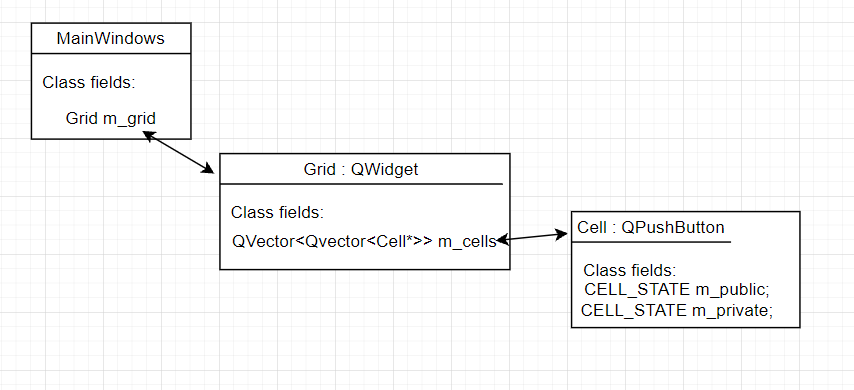

# MineSweeper_Qt
Minesweeper is a single-player puzzle video game. 

## Rules
Minesweeper rules are very simple. The board is divided into cells, with mines randomly distributed. To win, you need to open all the cells. The number on a cell shows the number of mines adjacent to it. Using this information, you can determine cells that are safe, and cells that contain mines. Cells suspected of being mines can be marked with a flag using the right mouse button.

## Features of game
1. Customizable number of cells, mines; 
2. Dynamic language preset;
3. Importable/Exportable `JSON` config with settings preset; 

## Architecture
Game field is based on buttons mesh. In case it was used `QGraphicsScene` with custom editable `QGraphicsItems` we would be obliged to override their look [paint()](https://doc.qt.io/qt-5/qgraphicsitem.html#paint). Standard `QPushButton` are used. 

